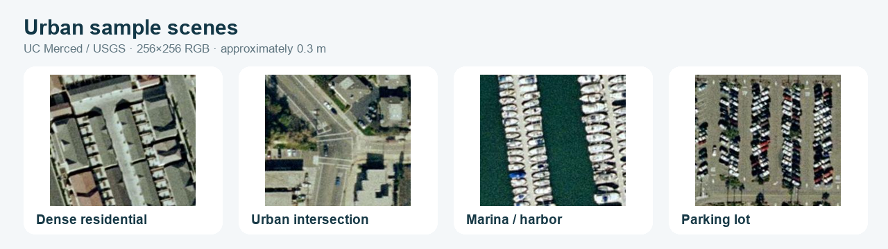
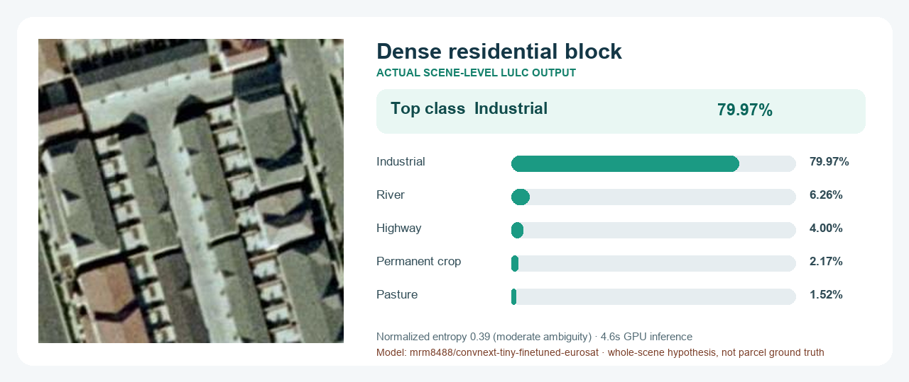
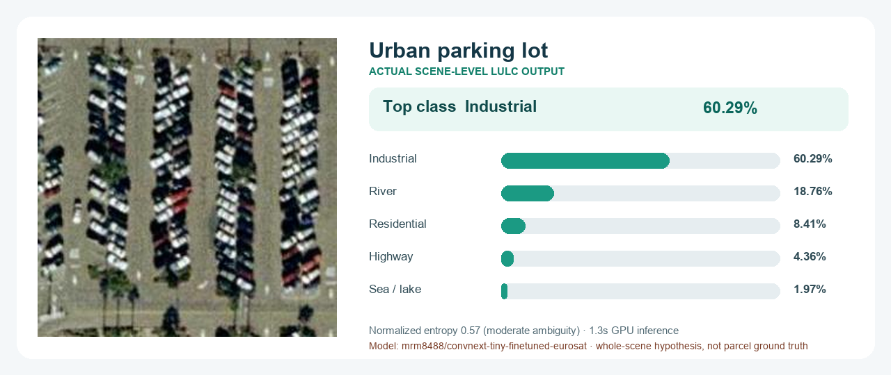

<div align="center">

# 🛰️ Satellite Vision Toolkit

### Professional scene, pixel, and object-level analysis for overhead imagery

[](https://huggingface.co/spaces/Mingze/SatelliteVisionToolkit)
[](https://huggingface.co/bluelabel/satellite-equipment-detection-yolov8n-vhr10)
[](https://huggingface.co/mfaytin/mask2former-satellite)
[](https://huggingface.co/mrm8488/convnext-tiny-finetuned-eurosat)
[](LICENSE)

**Upload one satellite or aerial image, run a multi-model assessment, and download reusable visual and machine-readable evidence.**

[**🚀 Launch the live app**](https://huggingface.co/spaces/Mingze/SatelliteVisionToolkit) ·
[**💻 GitHub source**](https://github.com/LabMingzeChen/SatelliteVisionToolkit)

</div>



## What it does

The app provides three complementary analytical levels plus a one-click combined workflow:

| Mode | Model | Output vocabulary |
|---|---|---|
| Scene-level LULC classification | ConvNeXT-Tiny fine-tuned on EuroSAT | annual crop, forest, herbaceous vegetation, highway, industrial, pasture, permanent crop, residential, river, sea/lake |
| Object detection | YOLOv8n fine-tuned on NWPU VHR-10 | airplane, ship, storage tank, baseball diamond, tennis court, basketball court, ground track field, harbor, bridge, vehicle |
| Land-cover segmentation | Mask2Former fine-tuned on OpenEarthMap | background, bare land, grass, pavement, road, tree, water, cropland, building |

Every run creates visual and machine-readable outputs:

- Ranked LULC probabilities, a confidence tier, normalized entropy, and CSV/JSON exports.
- Detection overlay, per-class summary, per-object CSV, and pixel-coordinate GeoJSON.
- Land-cover overlay, categorical mask, raw class-ID PNG, and class-area CSV.
- A professional executive dashboard and complete JSON evidence package.
- Independent Gradio API endpoints at `/classify`, `/segment`, `/detect`, and `/analyze`.
- A reusable Codex skill and command-line Space client.

## Urban sample scenes

The interface includes four visible, one-click urban chips from the [UC Merced Land Use dataset](https://huggingface.co/datasets/blanchon/UC_Merced). Each is a 256×256 RGB aerial image at approximately 0.3 m spatial resolution, derived from USGS National Map Urban Area Imagery.

| Case | Urban features | Suggested use |
|---|---|---|
| Dense residential | roofs, streets, impervious surfaces | Review residential LULC confidence and building/pavement segmentation |
| Urban intersection | road markings, pavement, small vehicles | Test road segmentation and the limits of small-object detection |
| Marina / harbor | water, docks, tightly spaced boats | Compare water cover with ship/harbor predictions |
| Parking lot | pavement and tightly packed vehicles | Probe pavement share and vehicle detection sensitivity |

These images are method-exploration examples, not ground-truth demonstrations. Their sub-meter aerial scale differs substantially from the EuroSAT classifier's Sentinel-2 training domain, so classification results should be interpreted as domain-shifted hypotheses.

## Real model results

The cards below are reproducible outputs returned by the live Space `/classify` endpoint on July 31, 2026. They show the original urban chip, top-five EuroSAT probabilities, normalized entropy, and measured GPU inference time.

### Dense residential case



| Top prediction | Probability | Normalized entropy | Runtime |
|---|---:|---:|---:|
| Industrial | 79.97% | 0.388 | 4.6 s |

### Parking-lot case



| Top prediction | Probability | Normalized entropy | Runtime |
|---|---:|---:|---:|
| Industrial | 60.29% | 0.569 | 1.3 s |

> **Why both results say “Industrial”:** this is a useful domain-shift finding, not a corrected label. The classifier learned from 10 m Sentinel-2 EuroSAT tiles, while these examples are approximately 0.3 m aerial chips. The full probability profile and entropy expose that uncertainty. Use pixel segmentation and object detection as complementary evidence rather than treating the scene label as ground truth.

The committed values are stored in [`assets/results/urban_case_results.json`](assets/results/urban_case_results.json). Regenerate the presentation graphics with:

```bash
python scripts/build_readme_examples.py
```

## How it works

```text
Satellite or aerial RGB image
    ├── ConvNeXT-Tiny / EuroSAT
    │     ├── ranked scene-level LULC probabilities
    │     ├── normalized uncertainty (entropy)
    │     └── classification CSV + JSON
    │
    ├── YOLOv8n / NWPU VHR-10
    │     ├── labeled bounding-box overlay
    │     ├── class counts and confidence
    │     ├── per-object CSV
    │     └── image-pixel GeoJSON
    │
    └── Mask2Former / OpenEarthMap
          ├── land-cover overlay
          ├── categorical color mask
          ├── raw class-ID PNG
          └── per-class pixel-share CSV
```

Images are orientation-corrected, converted to RGB, and bounded to 2048 pixels on their longest side. The first request downloads the public model weights; later requests reuse the container cache. CUDA is used when available and CPU remains supported.

## Run locally

```bash
git clone https://github.com/LabMingzeChen/SatelliteVisionToolkit.git
cd SatelliteVisionToolkit
python -m venv .venv
source .venv/bin/activate
pip install -r requirements.txt
python app.py
```

Open the local Gradio URL. PNG, JPEG, WebP, and RGB TIFF inputs work best.

## Call the Hugging Face API

```python
from gradio_client import Client, handle_file

client = Client("Mingze/SatelliteVisionToolkit")

classification = client.predict(
    handle_file("satellite.jpg"),
    5,
    api_name="/classify",
)

detection = client.predict(
    handle_file("satellite.jpg"),
    0.25,
    0.45,
    api_name="/detect",
)

segmentation = client.predict(
    handle_file("satellite.jpg"),
    0.55,
    0.10,
    api_name="/segment",
)

complete = client.predict(
    handle_file("satellite.jpg"),
    5, 0.55, 0.10, 0.25, 0.45,
    api_name="/analyze",
)
```

The bundled CLI wraps the same endpoints:

```bash
python scripts/satellite_client.py classify satellite.jpg --output classification.json
python scripts/satellite_client.py detect satellite.jpg --output detection.json
python scripts/satellite_client.py segment satellite.jpg --output segmentation.json
python scripts/satellite_client.py analyze satellite.jpg --output complete.json
```

## Project structure

```text
SatelliteVisionToolkit/
├── app.py                     Gradio UI and inference workflows
├── satellite_utils.py         Rendering, summaries, CSV, and GeoJSON exports
├── scripts/satellite_client.py
├── scripts/build_readme_examples.py
├── assets/cases/                Urban source images
├── assets/results/              README gallery, result cards, and result JSON
├── tests/                     Lightweight deterministic tests
├── skills/                    Reusable Codex workflow
└── .codex-plugin/plugin.json  Codex plugin manifest
```

## Models, data, and licensing

The application code is MIT licensed. Model software, weights, and training data keep their own terms.

| Resource | Role | Terms noted by source |
|---|---|---|
| [`mrm8488/convnext-tiny-finetuned-eurosat`](https://huggingface.co/mrm8488/convnext-tiny-finetuned-eurosat) | Scene-level LULC classifier | Model card lists Apache-2.0 |
| [EuroSAT](https://huggingface.co/datasets/GFM-Bench/EuroSAT) | LULC classification dataset | Review dataset terms and cite Helber et al. |
| [`bluelabel/satellite-equipment-detection-yolov8n-vhr10`](https://huggingface.co/bluelabel/satellite-equipment-detection-yolov8n-vhr10) | Remote-sensing object detector | Model card lists MIT; Ultralytics runtime has separate licensing |
| [NWPU VHR-10](https://gcheng-nwpu.github.io/#Datasets) | Detection training dataset | Review dataset terms and cite its authors |
| [`mfaytin/mask2former-satellite`](https://huggingface.co/mfaytin/mask2former-satellite) | Land-cover segmentation model | Model card lists MIT |
| [OpenEarthMap](https://open-earth-map.org/) | Segmentation training dataset | Review dataset terms and cite Xia et al. |

## Limitations and responsible use

- Results vary with spatial resolution, sensor, geography, season, atmospheric conditions, shadows, and image preprocessing.
- EuroSAT classification is a whole-scene hypothesis learned from small European Sentinel-2 RGB tiles; it is not parcel delineation, zoning, cadastral, or legal land-use evidence.
- Review ranked alternatives and normalized entropy. A confident prediction can still be wrong under domain shift.
- Small objects may disappear during resizing or fall below the confidence threshold.
- Detection counts describe visible predictions, not complete inventories.
- Segmentation shares describe processed image pixels, not surveyed ground area.
- Exported GeoJSON uses top-left-origin image pixels and has no geographic CRS. It must not be overlaid on a map as if it were georeferenced.
- Do not use predictions alone for navigation, legal boundaries, surveillance, military targeting, emergency response, or other safety-critical decisions.
- Avoid uploading private or sensitive imagery to a public Space.

## Citation

```bibtex
@software{chen2026satellitevisiontoolkit,
  author = {Chen, Mingze},
  title  = {Satellite Vision Toolkit},
  year   = {2026},
  url    = {https://github.com/LabMingzeChen/SatelliteVisionToolkit}
}
```

Please also cite NWPU VHR-10, OpenEarthMap, YOLO/Ultralytics, and Mask2Former as applicable.
